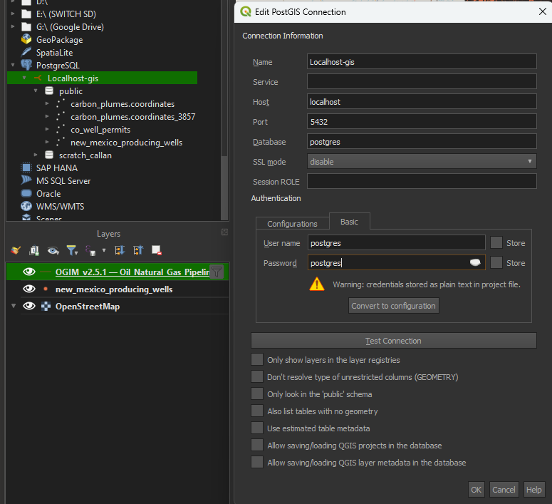
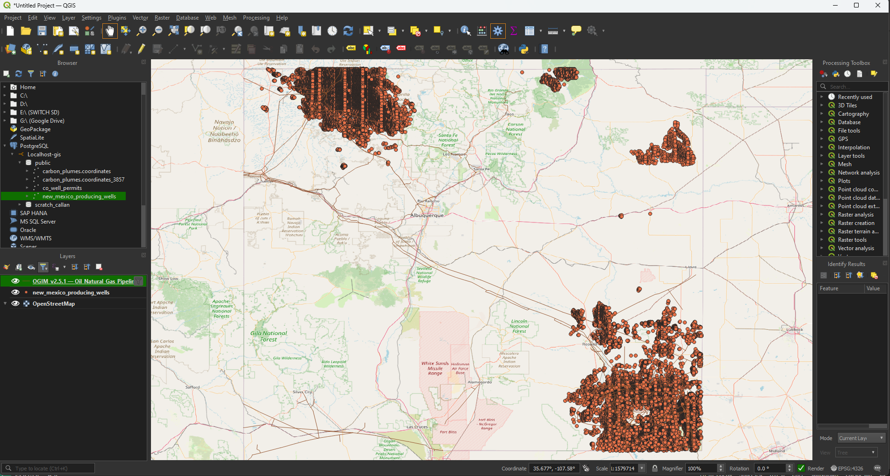

# Loading data to PostGIS enabled PG database & visualizing in QGIS

# Learning objectives:
- Install postgres with PostGIS extension enabled
- Install QGIS
- Create a new python environment and install the required packages
- Download data from a public source
- Load data to PostGIS enabled PG database using python.
- Create a new python script to load data to PostGIS enabled PG database.
- Visualize data in QGIS.

# Lab 1 instructions:

1. Install postgres with PostGIS extension enabled.
    MacOS: https://www.youtube.com/watch?v=gQ7CKyNl_ZM
    Windows: https://www.youtube.com/watch?v=EkQ9c8bUNIk

2. Install QGIS
    https://www.qgis.org/download/

3. Create a new python environment and install the required packages: geopandas, sqlalchemy, psycopg2-binary, psycopg2

4. Download .gpkg file from https://zenodo.org/records/13259749/files/OGIM_v2.5.1.gpkg?download=1 of Oil & Gas locations

5. Load this data to PostGIS enabled PG database using the load_wells.py script.

6. Using the same pattern, create a new python script to load the 'Oil_Natural_Gas_Pipelines' layer from the .gpkg file to the database. The same data filtering criteria should be applied(New Mexico only).

7. Using QGIS, create a new project and load the 'Oil_Natural_Gas_Pipelines' layer.

# Assessment:

Copy the python script you created for loading the 'Oil_Natural_Gas_Pipelines' layer inside the assessment folder.

Take a screenshot of the QGIS project with the 'Oil_Natural_Gas_Pipelines' & 'Oil_and_Natural_Gas_Wells' layers loaded with the colors changed from the example screenshot.

Commit and push your changes to the repository.
