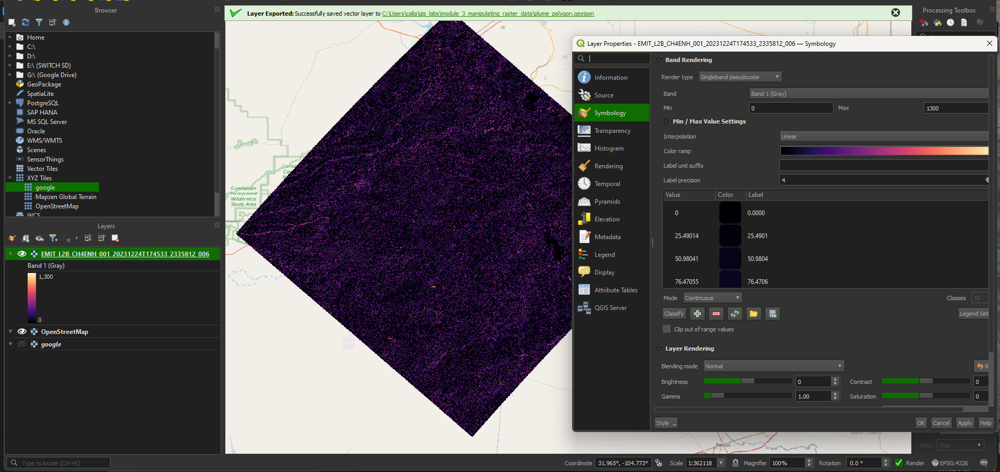
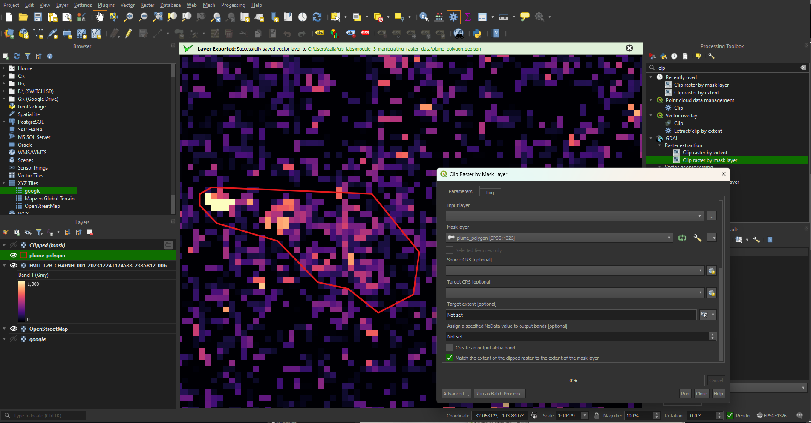

# Working with raster data

# Learning objectives:
- NASA Earthsearch 
- QGIS geoprocessing tools
- Raster symbology
- Creating your own raster datasets
- Exporting raster data to GeoTiff from QGIS
- Exporting raster data to STAC

# Lab 3 instructions:
1. Register for an Earthdata account if you don't have one already at: https://urs.earthdata.nasa.gov/users/new

2. Download EMIT methane raster from NASA Earthsearch at https://data.lpdaac.earthdatacloud.nasa.gov/lp-prod-protected/EMITL2BCH4ENH.001/EMIT_L2B_CH4ENH_001_20231224T174533_2335812_006/EMIT_L2B_CH4ENH_001_20231224T174533_2335812_006.tif

3. Open the raster in QGIS and apply value filter from 0-1300 & apply the MAGMA colorbar 

4. Bring in plume_polygon.geojson to QGIS and clip the raster using the "Clip raster by mask layer" tool

5. Apply the same symbology to the clipped raster as you did to the original raster

6. Export the clipped and symbolized raster as a GeoTiff to the assessment folder with these settings:

7. Using the python script from module_2, export the clipped raster to a new STAC collection called "nasa_emit_methane_plumes"

# Assessment:

Take a screenshot of the "bbox" & "assets" portion of the JSON from the output of the python script where you loaded the clipped methane plume to a new STAC collection and save it inside the assessment folder.

Copy the exported GeoTiff image inside the assessment folder.

Commit and push your changes to the repository. 