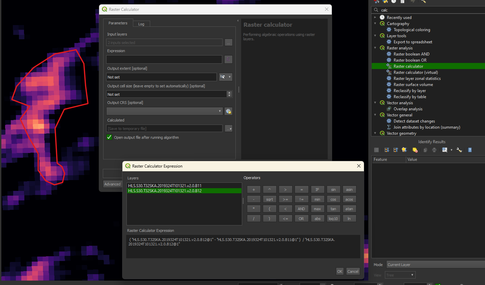
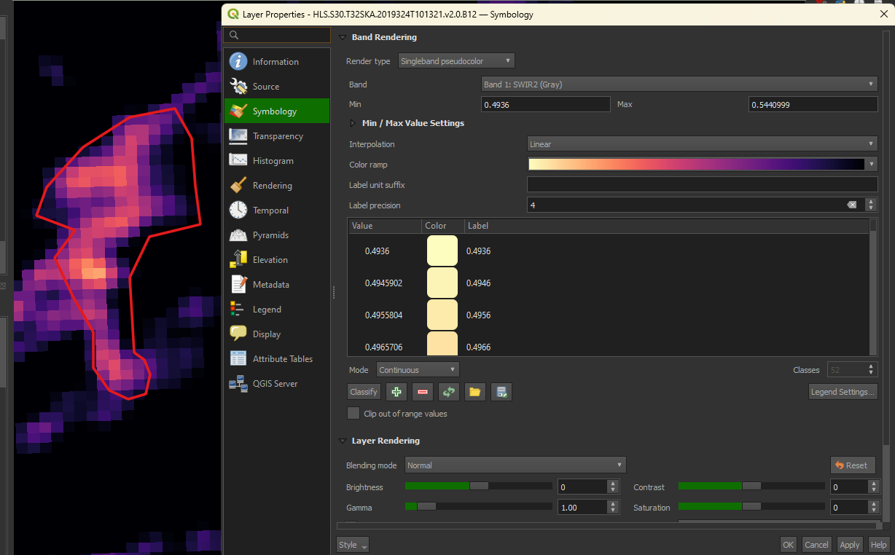
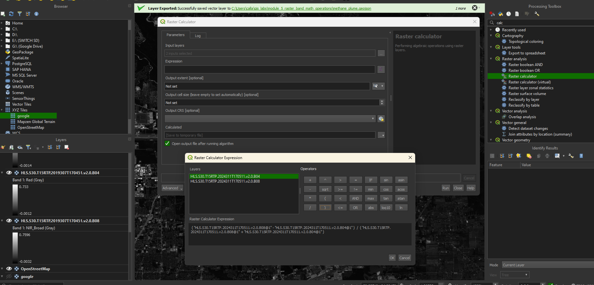
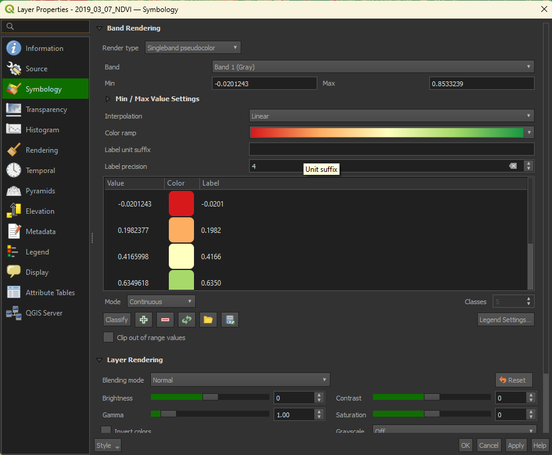
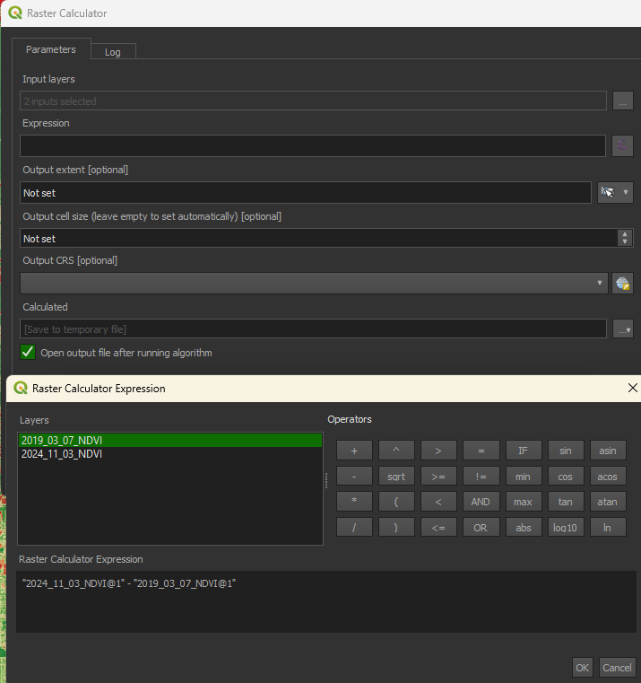
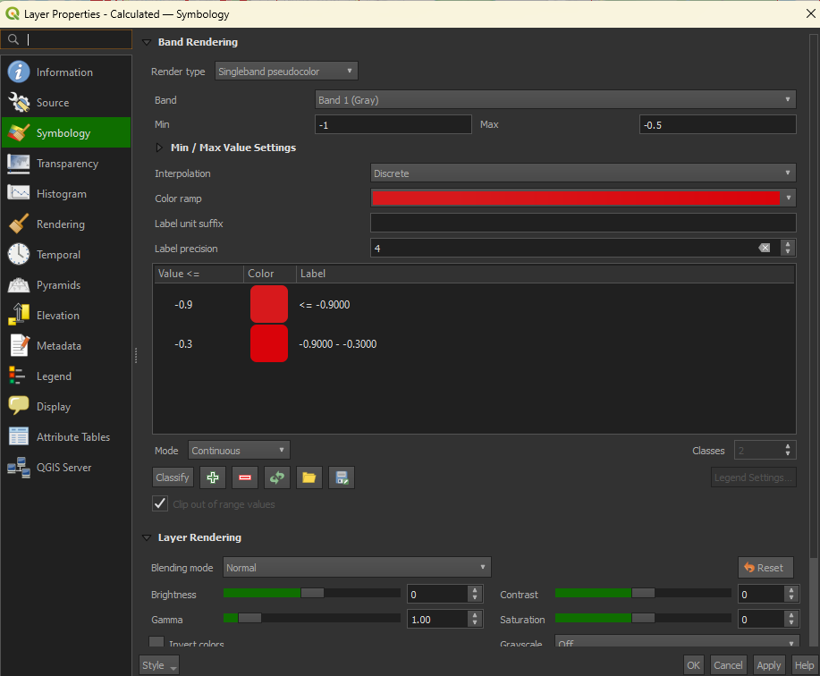
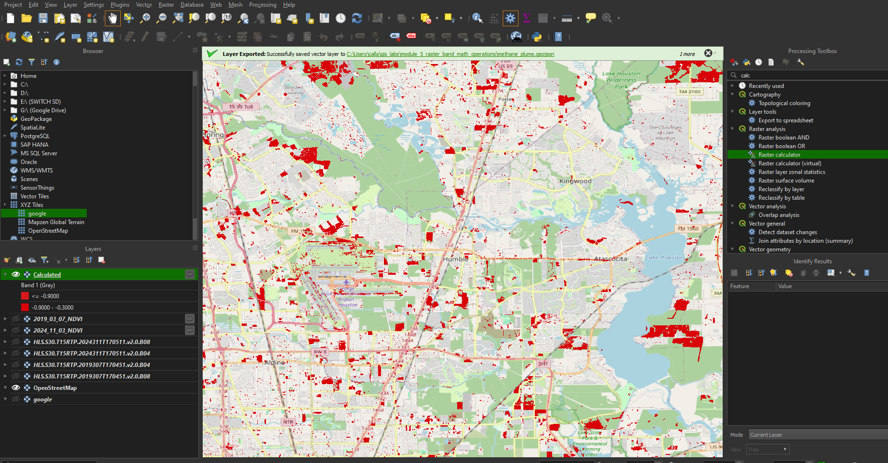

# Raster band math operations

# Learning objectives:
- Raster band math operations
- Multi Band Single Pass(MBSP) Methane Index
- Normalized Difference Vegetation Index (NDVI)
- Change detection

# Lab 4 instructions:
## Part 1: Calculate the Multi Band Single Pass(MBSP) Methane Index
1. Register for an Earthdata account if you don't have one already at: https://urs.earthdata.nasa.gov/users/new or use the one you created in module_3.

2. Download the following two raster files from NASA Earthdata:

https://data.lpdaac.earthdatacloud.nasa.gov/lp-prod-protected/HLSS30.020/HLS.S30.T32SKA.2019324T101321.v2.0/HLS.S30.T32SKA.2019324T101321.v2.0.B11.tif
https://data.lpdaac.earthdatacloud.nasa.gov/lp-prod-protected/HLSS30.020/HLS.S30.T32SKA.2019324T101321.v2.0/HLS.S30.T32SKA.2019324T101321.v2.0.B12.tif

2. Load them into QGIS and use the "Raster Calculator" tool to create a new raster using this expression (B12 - B11) / B11.

3. load the methane_plume.geojson file into QGIS.

4. Use the "Clip raster by mask layer" tool to clip the raster to the extent of the methane_plume.geojson file.

5. Set the symbology of the clipped raster to "Singleband pseudocolor" and use the settings in the screenshot below.

6. Save the clipped raster as a GeoTiff as a rendered image to the assessment folder.

## Part 2: Calculate Normalized Difference Vegetation Index (NDVI)

1. Download the following files from NASA Earthdata:

    https://data.lpdaac.earthdatacloud.nasa.gov/lp-prod-protected/HLSS30.020/HLS.S30.T15RTP.2019307T170451.v2.0/HLS.S30.T15RTP.2019307T170451.v2.0.B08.tif

    https://data.lpdaac.earthdatacloud.nasa.gov/lp-prod-protected/HLSS30.020/HLS.S30.T15RTP.2019307T170451.v2.0/HLS.S30.T15RTP.2019307T170451.v2.0.B04.tif

    https://data.lpdaac.earthdatacloud.nasa.gov/lp-prod-protected/HLSS30.020/HLS.S30.T15RTP.2024311T170511.v2.0/HLS.S30.T15RTP.2024311T170511.v2.0.B08.tif

    https://data.lpdaac.earthdatacloud.nasa.gov/lp-prod-protected/HLSS30.020/HLS.S30.T15RTP.2024311T170511.v2.0/HLS.S30.T15RTP.2024311T170511.v2.0.B04.tif

2. These files are for the same area but at two different dates. The first two files are from 2019 and the last two are from 2024. They contain data from Bands 8 and 4 from the Sentinel 2 satellite. We will use these to calculate the Vegetation Index (NDVI) for each date. Load them into QGIS and use the "Raster Calculator" tool to create two new rastesr using this expression (B08 - B04) / (B08 + B04) for each of the two dates. See the screenshot below for an example.

    You should end up with two new rasters. Style them to look like the screenshots below.

3. Run a final raster calculation to find the difference between the two NDVI rasters. Example below.

4. Style the difference raster to look like the screenshot below.

5. Center you map on Humble Texas and take a screenshot of the map using a different color than the example screenshot below. You have created a change detection map of north Houston area between 2019 and 2024.

# Assessment:

Copy the screenshots of the change detection map to the assessment folder.

Commit and push your changes to the repository. 

# Additional resources:
- [Multi Band Single Pass(MBSP) Methane Index](https://amt.copernicus.org/articles/14/2771/2021/)
- [Normalized Difference Vegetation Index (NDVI)](https://eos.com/make-an-analysis/ndvi/)
