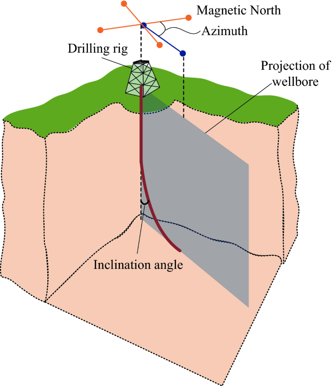
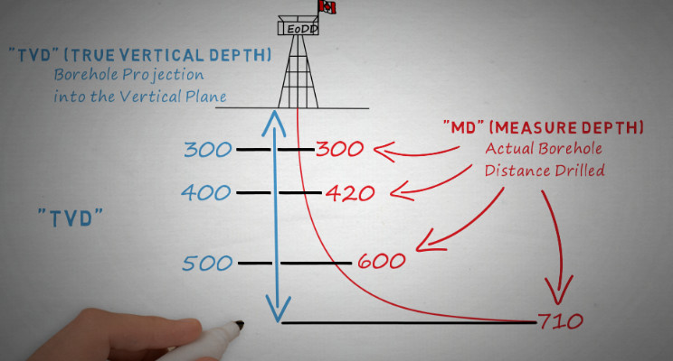
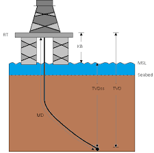

# Working with Well Surveys

# Learning objectives:
- Well Survey Fundamentals
- Inclination and Azimuth
- Measured Depth (MD) and True Vertical Depth (TVD)
- Subsea True Vertical Depth (SSTVD)
- Kelly Bushing (KB) Elevation
- Delta Northing and Delta Easting


# Lab 2 instructions:

## Part 1: Introduction to Well Survey Fundamentals

## Introduction:
Well surveys are essential measurements used to determine the exact position and path of a wellbore in three-dimensional space. These measurements are crucial for safe drilling operations, regulatory compliance, and optimal reservoir targeting.
Key Concepts and Measurements


## Inclination:

The angle between the wellbore direction and vertical
Measured in degrees from vertical (0° = vertical, 90° = horizontal)
Key factors:

0-10°: Considered a vertical well
10-80°: Directional well
80-90°: Horizontal well


## Azimuth:

The horizontal direction of the wellbore measured clockwise from true north
Measured in degrees (0-360°)
Examples:

0° or 360° = North
90° = East
180° = South
270° = West


## Measured Depth (MD):

Definition: The actual length of the wellbore measured along its path from the surface reference point
Always greater than or equal to True Vertical Depth
Used to calculate drilling progress and pipe requirements
Reference point is typically the Kelly Bushing (KB)

## True Vertical Depth (TVD):

The vertical distance from the KB to a point in the wellbore
Always less than or equal to MD for deviated wells
Critical for:

Formation pressure calculations
Correlating between wells
Regulatory compliance



## Subsea True Vertical Depth (SSTVD)

TVD minus the KB elevation
Provides depth relative to mean sea level
Essential for:

Regional geological correlation
Reservoir mapping
Field development planning

## Kelly Bushing (KB) Elevation:

The height of the drilling floor above mean sea level
Serves as the reference point for all depth measurements
Critical for correlating depths between wells in the same field
Usually measured in feet or meters above sea level


## 7. Delta Northing and Delta Easting

Horizontal components of the wellbore displacement
Delta Northing:

Distance north (+) or south (-) from the surface location
Used with coordinates systems


Delta Easting:

Distance east (+) or west (-) from the surface location
Combined with Northing for precise position
This is a top down view of the well path. The well path is shown in red. The surface location is shown in black. The Delta Northing is the distance north or south from the surface location. The Delta Easting is the distance east or west from the surface location. The Delta Northing and Delta Easting are used to determine the precise position of the wellbore.


## Part 2: 

1. We're going to now work with a real well survey dataset in Python. The dataset is in CSV format.
2. Change the input in the script below to use [colorado_400844163_directional.csv](colorado_400844163_directional.csv)  
3. Then change output path in the script below to match your local file paths and run this script in your Python environment.(Install the required libraries if you haven't already. pyproj, pandas, geopandas, shapely)

```python
import pandas as pd
import geopandas as gpd
from shapely.geometry import LineString
from pyproj import CRS, Transformer


# User inputs
input_csv = "/Users/.../Downloads/colorado_400844163_directional.csv"   # Path to your CSV file
output_shp = "/Users/.../Downloads/output_line_zm.shp" # Path to save the output shapefile
input_crs = CRS.from_epsg(2231)  # NAD83 / Colorado North
output_crs = CRS.from_epsg(3857) # Web Mercator

# Read the CSV
df = pd.read_csv(input_csv)

# Make sure MD column exists and sort by MD
if "MD" not in df.columns:
    raise ValueError("The CSV does not contain an 'MD' column.")

# Sort by MD
df = df.sort_values("MD")
X = df["X"].to_numpy()
Y = df["Y"].to_numpy()
Z = df["TVD"].to_numpy()
M = df["MD"].to_numpy()  # We'll store this as an attribute

# Create a list of 3D coordinates (X, Y, Z)
coords_3d = [(float(x), float(y), float(z)) for x, y, z in zip(X, Y, Z)]

# Create a 3D LineString
line_3d = LineString(coords_3d)

# Reproject the geometry
transformer = Transformer.from_crs(input_crs, output_crs, always_xy=True)
transformed_coords = []
for (x, y, z) in line_3d.coords:
    x2, y2 = transformer.transform(x, y)
    transformed_coords.append((x2, y2, z))

# Create a new LineString with transformed coordinates
line_3d_transformed = LineString(transformed_coords)

# Create a GeoDataFrame
gdf = gpd.GeoDataFrame(
    index=[0],
    crs=output_crs.to_wkt(),
    geometry=[line_3d_transformed]
)

# Store MD range as attributes, since we cannot keep M in geometry
gdf["MD_min"] = df["MD"].min()
gdf["MD_max"] = df["MD"].max()
gdf["TVD_min"] = df["TVD"].min()
gdf["TVD_max"] = df["TVD"].max()

# Save to shapefile
gdf.to_file(output_shp, driver="ESRI Shapefile")

print("Shapefile created:", output_shp)
```
1. The data is from https://github.com/agilescientific/welly/blob/facad6342ad6b18dbabf89ce67ec345187765bdd/tutorial/data/colorado_400844163_directional.csv
2. Take a screen shot of the output shapefile plotted in QGIS.
3. Now that you have an example of how to generate a shapefile from a well survey dataset, you can use this script to generate shapefiles for other well surveys.
4. Download https://github.com/agilescientific/welly/blob/facad6342ad6b18dbabf89ce67ec345187765bdd/tutorial/data/P-130_deviation_survey.csv and generate a shapefile from this dataset following the same logic as above.
5. Take a screenshot of the output shapefile plotted in QGIS.

# Assessment:


Take a screenshot of the first wellbore plotted in QGIS and save the screenshot in the `assessment` folder.
Take a screenshot of the first wellbore plotted in QGIS and save the screenshot in the `assessment` folder.

Commit and push your changes to the repository.


